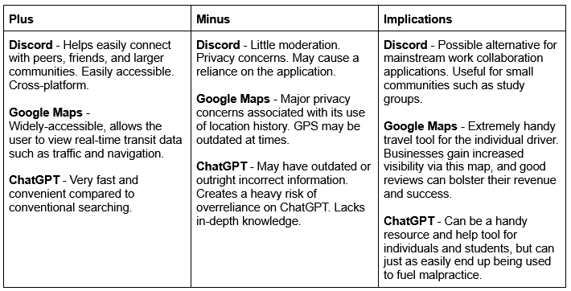
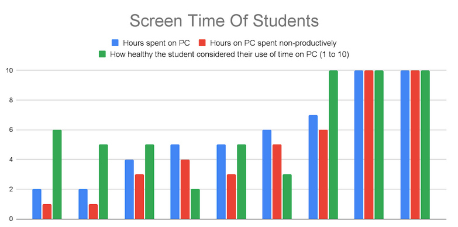
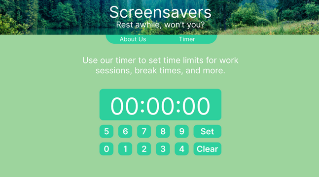

# Exploring Existing Ideas

# Secondary Research

[The Australian Department of Health](https://www.nsw.gov.au/education-and-training/digital-citizenship/parents-and-carers/managing-screen-time#:~:text=National%20guidelines%20for%20screen%20time,of%20sedentary%20recreational%20screen%20time.) recommends no more than 2 hours a day of recreational screen time - whilst the average recreational screen time of those surveyed averaged to approximately 4.8 hours, exceeding the daily recommended limit by more than two and a half times.

# Primary Research

Students consistently spent only 1 or 2 hours on productive computer work, while spending the remainder on recreation. On average,  students spend approximately 84% of their computer time on non-productive activity.

Due to the extremely uneven work-to-recreation ratio shown by students, as well as most students surpassing the amount of recommended screen time, the project will continue as in its current state.

# Prototype

